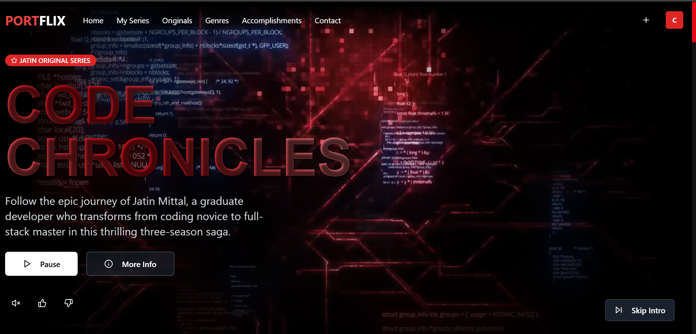

<div align="center">

# 🎬 PORTFLIX
**_Your Personal Portfolio, Reimagined as Netflix_**

[](https://nextjs.org/)
[](https://tailwindcss.com/)
[](https://www.framer.com/motion/)
[](https://www.typescriptlang.org/)

🍿 A unique, interactive, and visually stunning portfolio website designed with a Netflix-inspired UI/UX.
✨ Built with Next.js 14, Tailwind CSS, and Framer Motion for a captivating experience.

[🚀 Live Demo](https://portflix-three.vercel.app/) • [📚 Docs](https://github.com/Jat21in/PORTFLIX/) • [🐛 Report Bug](https://github.com/Jat21in/PORTFLIX/)



</div>

---

## 🌟 About PORTFLIX

**PORTFLIX** is not just another portfolio website; it's an immersive experience designed to showcase your work in a familiar and engaging Netflix-like interface. Built with **Next.js 14** using the App Router, styled with **Tailwind CSS**, and enhanced with **Framer Motion** for sleek animations, this project provides a unique way to present your skills, projects, and personal brand. It's fully responsive, ensuring a captivating experience across all devices.

---

## 🚀 Features

### Core Portfolio Functionality
- **Homepage**: A captivating "browse" screen featuring different "categories" of your work (e.g., "Featured Projects," "Latest Skills," "About Me").
- **Project Details**: Clickable "movie posters" or "show cards" leading to detailed pages for each project, complete with descriptions, technologies used, live links, and GitHub repositories.
- **Skills Showcase**: A section to display your technical skills, perhaps categorized by "genres" (e.g., "Frontend Development," "Backend Development," "Design Tools").
- **About Me**: A personal "profile" page detailing your background, experience, and passions.
- **Contact Me**: An easy way for visitors to connect with you, presented in a clean, integrated manner.

---

### 🎬 Netflix-Inspired UI/UX
- **Interactive Carousels**: Smooth, horizontally scrollable carousels for projects and skills, reminiscent of Netflix rows.
- **Hover Effects**: Engaging hover effects on project cards, revealing more details or a play icon.
- **Dark Theme**: A sleek, Netflix-inspired dark theme for an immersive visual experience.
- **Full-screen Modals**: Seamless display of project details or images within modals, similar to Netflix's content previews.
- **Search Functionality**: A "search bar" to quickly find specific projects or skills.

---

### 🎨 Design & Accessibility
- **Fully Responsive**: Optimized for mobile, tablet, and desktop with fluid layouts and transitions.
- **Smooth Animations**: Dynamic and engaging animations powered by Framer Motion for a delightful user experience.
- **Robust Feedback**: Clear loading states and error handling for a reliable application.
- **Accessible**: Semantic HTML, ARIA labels, keyboard navigation, and high contrast support.

---

## 🛠 Tech Stack

| Category        | Technology             | Purpose                                                                     |
|-----------------|------------------------|-----------------------------------------------------------------------------|
| 🚀 Framework    | Next.js 14 (App Router)| React framework for production-grade apps                                   |
| 🎨 Styling      | Tailwind CSS           | Utility-first CSS framework for rapid and custom UI development           |
| 🪄 Animations   | Framer Motion          | Production-ready motion library for React                                 |
| 🖼️ Icons        | Lucide React / React Icons| Beautiful and customizable open-source icons                                |
| 🛡️ Type Safety   | TypeScript             | Enhanced code quality and developer experience with static typing           |
| 📝 Data Mgmt    | Local JSON / Headless CMS | Flexible for local data or external content management (e.g., Strapi, Sanity)|

---

## 🚀 Getting Started

Follow these steps to get your development environment set up:

1.  **Clone the repository:**
    ```bash
    git clone <repository-url>
    cd portflix
    ```

2.  **Install dependencies:**
    ```bash
    npm install
    ```

3.  **Populate your data:**
    Edit the data in `data/projects.json`, `data/skills.json`, etc., to reflect your personal projects and information. Alternatively, integrate with a headless CMS (see Customization section).

4.  **Run the development server:**
    ```bash
    npm run dev
    ```

5.  **Open your browser:**
    Navigate to `http://localhost:3000` to see your PORTFLIX in action.

---

## 🎨 Customization & Enhancements

### Content Management
-   **Local JSON**: The project starts with local JSON files (`data/`) for projects, skills, and about information. This is great for quick setup.
-   **Headless CMS Integration**: For more dynamic content management, consider integrating with a headless CMS like:
    - **Sanity.io**
    - **Strapi**
    - **Contentful**
    - This would allow you to update your portfolio content without touching the code.

### Theming
Tailor the look and feel of your PORTFLIX:
-   Modify `app/globals.css` for global styles.
-   Adjust `tailwind.config.js` for theme configuration, custom colors, and font palettes to match your personal brand.
-   Style individual components for specific visual tweaks and Netflix-like elements (e.g., button styles, overlay effects).

### Adding Features
Expand your PORTFLIX's capabilities:
-   **Personalized Recommendations**: Implement a simple algorithm to "recommend" projects based on categories viewed.
-   **More "Browse" Categories**: Add sections for blog posts, testimonials, or services offered.
-   **Trailer-like Previews**: For video projects, embed short video previews that play on hover.
-   **User Authentication (for admin)**: If you want to manage content directly from the app, add a simple admin login.
-   **Language Switcher**: If you target a multi-lingual audience.

---

## 🚀 Deployment

This application is optimized for deployment on modern platforms:
-   **Vercel** (highly recommended for Next.js projects)
-   **Netlify**
-   **AWS Amplify**

### Environment Setup

If you integrate with a headless CMS or any third-party service, remember to:
1.  Create a `.env.local` file in the root directory.
2.  Add your API credentials and relevant environment variables to this file (consult the specific service's documentation for required keys).
3.  Ensure these variables are properly accessed in your Next.js application.

---

## 🤝 Contributing

We welcome contributions to make PORTFLIX even better! To get started:
1.  Fork the repository.
2.  Create a new feature branch (`git checkout -b feature/your-feature-name`).
3.  Make your changes and ensure they adhere to existing code styles.
4.  Add tests if applicable to cover new functionalities.
5.  Submit a pull request with a clear description of your changes.

---

## 📄 License

This project is licensed under the MIT License - see the [LICENSE](LICENSE) file for details.

## 🙏 Acknowledgments

<div align="center">

**Built with dedication and a binge-watching spirit.**

Special thanks to:
 🌟 Netflix for the incredible UI/UX inspiration.
 ⚛️ The Next.js team for creating such a powerful and versatile framework.
 ✨ Framer Motion for making animations a joy.
 ☁️ Vercel for their seamless hosting and deployment tools.

---

<sub>Made with ❤️ and 🍿 by JATIN MITTAL who believes every portfolio deserves a premiere</sub>

**[⭐ Star this repo](https://github.com/Jat21in/PORTFLIX/)** • **[🐛 Report Bug](https://github.com/Jat21in/PORTFLIX/issues)** • **[💡 Request Feature](https://github.com/Jat21in/PORTFLIX/issues)**

</div>
